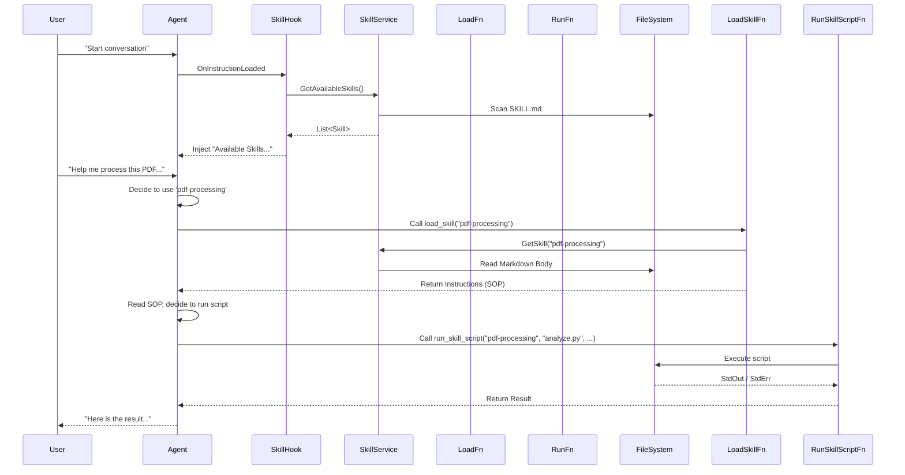

# Anthropic Agent Skills 设计文档 (Design)

## 1. 概述 (Overview)
本设计旨在 BotSharp 中实现 Agent Skills 标准。通过一个新的插件 `BotSharp.Plugin.AgentSkills`，提供技能发现、动态加载和脚本执行的能力。该设计遵循“渐进式披露”原则，降低 Agent 的初始上下文负载。

## 2. 架构 (Architecture)
架构主要由以下几个核心组件组成：

1.  **AgentSkillPlugin**: 插件入口，注册服务、配置和钩子。
2.  **AgentSkillService**: 核心服务，负责扫描文件系统、解析 `SKILL.md`、缓存技能元数据。
3.  **AgentSkillHook**: 实现 `IAgentHook`，在 Agent 加载阶段注入可用技能的摘要（Awareness）。
4.  **Function Tools**:
    *   `LoadSkillFn`: 实现 `IFunctionCallback`，用于动态加载技能详情。
    *   `RunSkillScriptFn`: 实现 `IFunctionCallback`，用于执行技能脚本。
5.  **ScriptExecutor**: 负责安全地在宿主环境中执行脚本（主要是 Python）。

### 2.1 依赖关系
*   `BotSharp.Abstraction`: 核心接口 (`IBotSharpPlugin`, `IAgentHook`, `IFunctionCallback`).
*   `BotSharp.Plugin.PythonInterpreter`: 用于执行 Python 脚本。需要扩展以支持执行预定义文件。
*   `YamlDotNet`: 用于解析 YAML Frontmatter。
*   `System.Diagnostics.Process`: 用于执行外部脚本。

## 3. 组件与接口 (Components & Interfaces)

### 3.1 数据模型 (Models)

为了准确解析 `SKILL.md` 的 YAML Frontmatter，我们需要定义对应的强类型模型：

```csharp
public class AgentSkill
{
    public string Name { get; set; }
    public string Description { get; set; }
    public string MarkdownBody { get; set; } // 正文指令内容
    public string BaseDir { get; set; } // 技能所在的物理目录路径
    public List<string> Scripts { get; set; } // 可执行脚本列表
    public List<string> Resources { get; set; } // 静态资源列表
}

/// <summary>
/// 用于 YAML 反序列化的中间模型
/// </summary>
public class SkillFrontmatter
{
    [YamlMember(Alias = "name")]
    public string Name { get; set; }

    [YamlMember(Alias = "description")]
    public string Description { get; set; }
}

public class AgentSkillsSettings
{
    public string DataDir { get; set; } = "skills";
}
```

### 3.2 核心服务 (AgentSkillService)

`AgentSkillService` 应该注册为 **Singleton**，以维护技能缓存并处理热重载。

*   **职责**:
    1.  启动时递归扫描配置的 Skills 目录。
    2.  解析 `SKILL.md` 并构建 `AgentSkill` 对象。
    3.  维护 `ConcurrentDictionary<string, AgentSkill>` 缓存。
    4.  使用 `FileSystemWatcher` 监听 `*.md` 文件的变更，实现 Hot Reload。

```csharp
public interface IAgentSkillService
{
    // 扫描并返回所有可用技能的摘要（Name & Description）
    Task<List<AgentSkill>> GetAvailableSkills();

    // 获取特定技能的详细信息（包含 MarkdownBody）
    Task<AgentSkill> GetSkill(string name);

    // 验证并获取脚本路径
    string GetScriptPath(string skillName, string scriptFile);
    
    // 手动刷新缓存（可选，配合 Watcher 使用）
    Task RefreshSkills();
}
```

### 3.3 生命周期钩子 (AgentSkillHook) (实现细节)

**阶段一：发现 (Discovery)**
*   **Hook**: `OnInstructionLoaded`
*   **逻辑**:
    1.  调用 `IAgentSkillService.GetAvailableSkills()`。
    2.  构造“技能菜单”提示词：
        ```text
        You have access to the following specialized skills. If a task requires one, call the 'load_skill' function with the skill name.
        
        - pdf-processing: Handles PDF files...
        - data-analysis: Performs statistical analysis...
        ```
    3.  此段提示词作为 System Instruction 的一部分注入。

**阶段二：激活 (Activation)**
*   **Hook**: `OnInstructionLoaded` (再次触发时)
*   **逻辑**:
    1.  检查 `conversation_state` 中的 `active_skills` 列表。
    2.  如果发现已激活的技能（例如 "pdf-processing"），从 `AgentSkillService` 获取其 `MarkdownBody`。
    3.  将正文注入 Prompt：
        ```text
        ### ACTIVE SKILL: PDF PROCESSING
        (Markdown content...)
        ```

**阶段三：执行 (Execution)**
*   **Hook**: `OnFunctionsLoaded`
*   **逻辑**:
    1.  虽然 `run_skill_script` 是通用函数，但可以在此 Hook 中做权限校验或动态提示。
    2.  确保 `load_skill` 和 `run_skill_script` 工具已添加到当前 Agent 的功能列表中。
    3.  (可选) 遍历 `active_skills`，显式提示用户当前可执行的脚本列表（虽然主要依靠 Markdown Body 中的 SOP 指引）。

### 3.4 工具 (Functions)

#### LoadSkillFn
*   **Name**: `load_skill`
*   **Logic**:
    1.  接收 `skill_name`。
    2.  更新 `conversation_state["active_skills"]`，加入该技能。
    3.  **关键**: 返回提示 "Skill '{skill_name}' activated. Please continue."，促使 LLM 在下一轮对话中利用新注入的 Prompt（因 `OnInstructionLoaded` 会在每轮生成 Prompt 时运行）。

#### RunSkillScriptFn
*   **Name**: `run_skill_script`
*   **Input**: `skill_name`, `script_file`, `args` (string/json)
*   **Logic**:
    1. 验证 `skill_name` 和 `script_file` 合法性（防止目录遍历）。
    2. 定位物理文件路径。
    3. 启动 `python` 进程执行脚本。
    4. 捕获 Standard Output 和 Standard Error。

### 3.5 脚本执行增强 (BotSharp.Plugin.PythonInterpreter Extension)

为了支持执行预定义的本地 Python 文件，我们需要扩展 `PyCodeInterpreter` 或提供新的服务接口。

*   **新增接口**: `IPyScriptExecutor` (或在 `ICodeProcessor` 中增加方法)
    ```csharp
    public interface IPyScriptRunner
    {
        // 直接运行指定路径的 py 文件，并传入参数
        Task<string> RunScript(string filePath, string args);
    }
    ```
*   **实现逻辑**:
    *   复用现有的 Python 环境配置 (`PythonInterpreterSettings`)。
    *   使用 `Process.Start` 启动 python 进程。
    *   Argument 传递：`python "path/to/script.py" "args_string"`。
    *   在 `AgentSkill` 插件中，通过 DI 获取此服务来执行 `RunSkillScriptFn` 中的请求。

## 4. 流程设计 (Flows)

### 4.1 总体交互流程



## 5. 错误处理 (Error Handling)
*   **文件未找到**: 如果加载不存在的 Skill，返回明确错误 "Skill not found".
*   **脚本安全**:
    *   严禁 `script_file` 包含 `..` 或绝对路径。
    *   仅允许执行 `scripts/` 子目录下的文件。
*   **执行失败**: 脚本退出码非 0 时，捕获 Stderr 并以 "Execution Failed: ..." 格式返回。

## 6. 测试策略 (Testing Strategy)
*   **单元测试**: 针对 `AgentSkillService` 的 YAML 解析逻辑。
*   **集成测试**:
    *   构建一个真实的 `skills/test-skill` 目录。
    *   模拟 Agent 调用流程，验证 System Prompt 注入是否正确。
    *   验证 `load_skill` 是否返回各个 section。
    *   验证 `run_skill_script` 能否执行简单的 python print 脚本。
