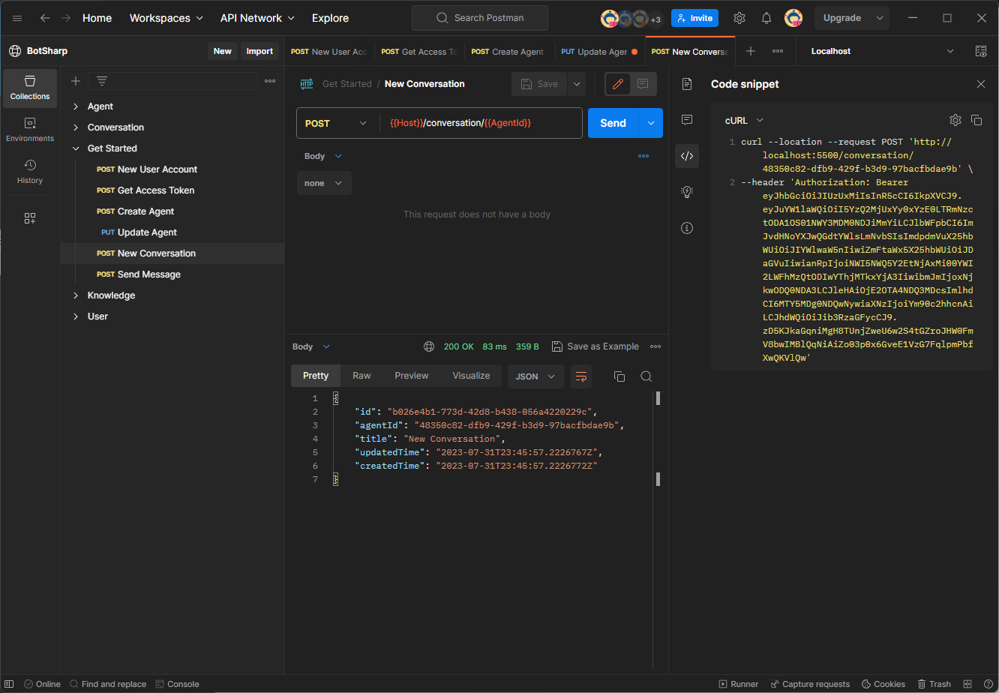
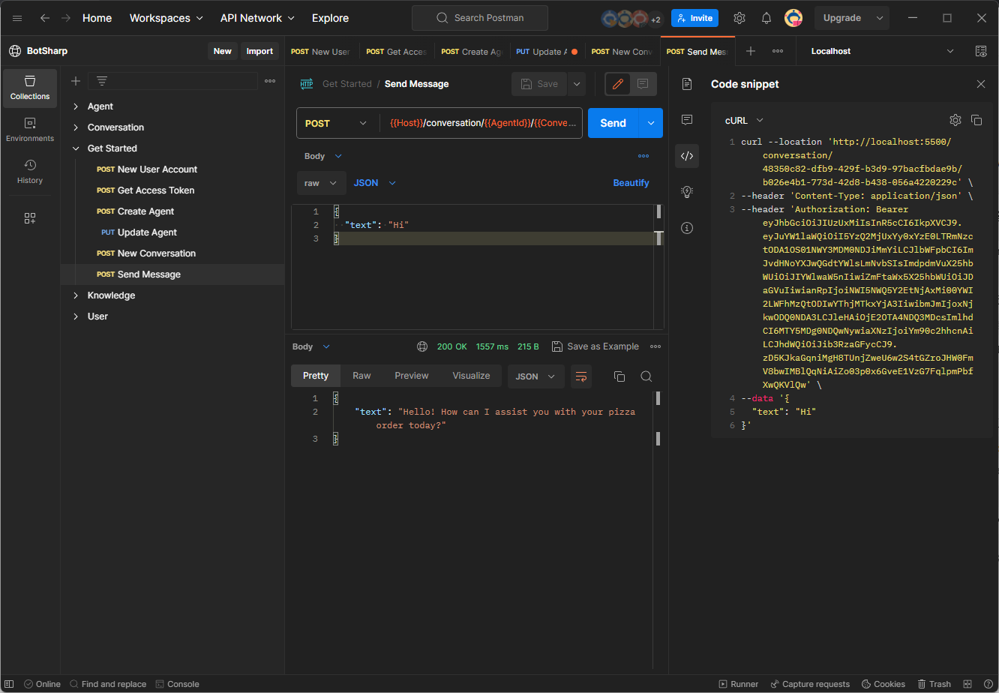

# Conversation

## Start a conversation
Before each new dialogue with the Agent, a new Conversation needs to be created, that is, the Session. The advantage of this Conversation is that it can help users manage the dialogue context. LLM needs to generate the next conversation content based on the history of the whole conversation.

## Send message
Congratulations, the entire Agent configuration is complete, and now you can start [Sending Messages](https://www.postman.com/orange-flare-634868/workspace/botsharp/request/1346299-6f51dfe2-0ea5-4910-bf62-f5515f46db73) to your Chatbot through the API.

