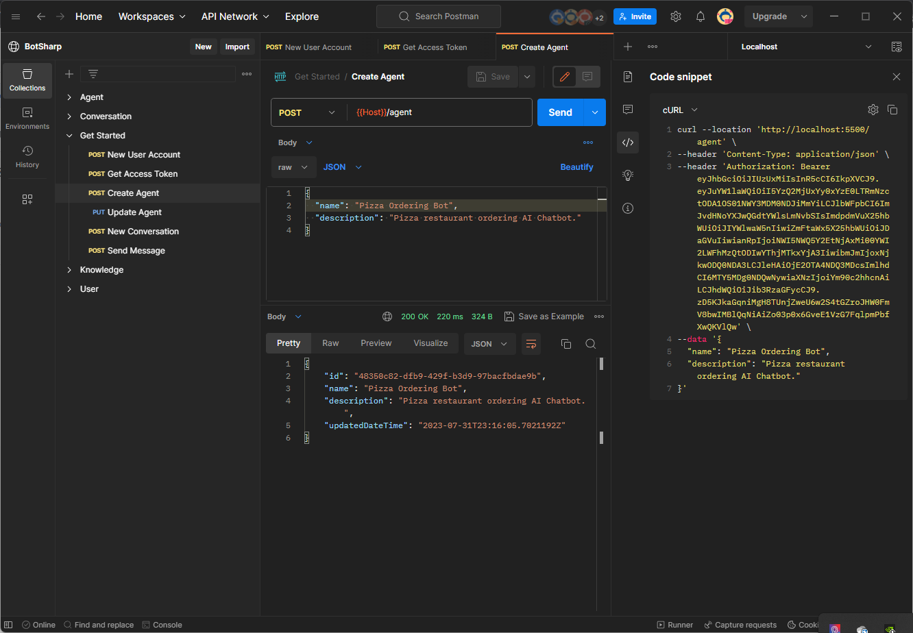
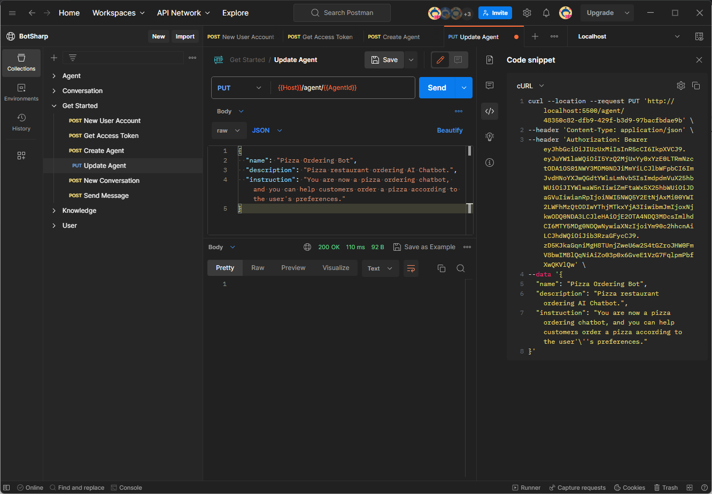

# Agent Introduction

An agent helps you process user sentences (unstructure data) into structure data that you can use to return an appropriate response.

Agent is a collection that contains prompt words and function Json Schema definitions, few-shot examples and knowledge base data. You can create multiple different Agents to perform specific operations in specific domains. BotSharp has built-in maintenance for Agents, including creating, updating and deleting, importing and exporting. Agents are divided into task agents and routing (non-task) agents. Business domain agents belong to task agents, and routers belong to non-task agents.

## My Agent
After creating the platform account, you can start to enter the steps of creating the Agent.

### Agent creation
Suppose we need to write a Pizza restaurant order AI Bot. First, specify a name and description, then call the [Agent creation](https://www.postman.com/orange-flare-634868/workspace/botsharp/request/1346299-dc57eddb-a3eb-41f1-9c6c-ac65f9d8d510) API to create a new robot, and the system will return an internally used Agent Id. This Id needs to be used in subsequent interactions.



### Agent instruction
BotSharp uses the latest large language model in natural language understanding, can interact with OpenAI's ChatGPT, and also supports the most widely used open source large language model [LLaMA](https://ai.meta.com/blog/large-language-model-llama-meta-ai/) and its fine-tuning model. In this example, we use [Azure OpenAI](https://azure.microsoft.com/en-us/products/ai-services/openai-service) as the LLM engine. 

```json
"LlmProviders": [
    {
        "Provider": "azure-openai",
        "Models": [{
            "Name": "gpt-35-turbo",
            "ApiKey": "",
            "Endpoint": "https://gpt-35-turbo.openai.azure.com/",
            "Type": "chat",
            "PromptCost": 0.0015,
            "CompletionCost": 0.002
        }]
    }
]
```

If you use the installation package to run, please ensure that the [BotSharp.Plugin.AzureOpenAI](https://www.nuget.org/packages/BotSharp.Plugin.AzureOpenAI) plugin package is installed.

Now we can update the prompt to the chatbot definition through the [Agent Update](https://www.postman.com/orange-flare-634868/workspace/botsharp/request/1346299-01c38741-987b-42af-850d-1b1e21b506df) API.



After the update is successful, the robot will have a system prompt, and the subsequent dialogue will interact with the user based on the background knowledge of the system prompt. So far, the creation of the Agent has been completed, but the real dialogue has not yet started. The following will continue to introduce the last step, the [Agent Conversation](../conversation/intro.md) part.