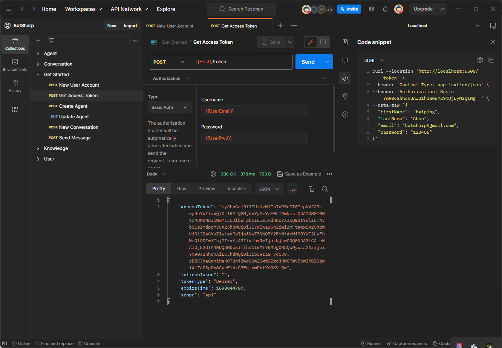

# Authentication

## User Account
As a Bot construction framework, the most basic step is to integrate the user authentication function, so that the back-end API can recognize which user the current request comes from. In this way, a more complete business system can be further constructed. BotSharp can be combined with the user authentication function of ASP.NET MVC.

### Create a user account
Use the [Account Creation](https://www.postman.com/orange-flare-634868/workspace/botsharp/request/1346299-1b868c08-c6ac-48a5-94ab-93f6f080c085) API in BotSharp to create the first platform user.

## Get access token
After the platform user is created, the user token can be obtained through the [Get Token](https://www.postman.com/orange-flare-634868/workspace/botsharp/request/1346299-5d70fec4-dfa0-4b74-a4fd-8cd21009d44f) API, and this token is required in all subsequent APIs.

