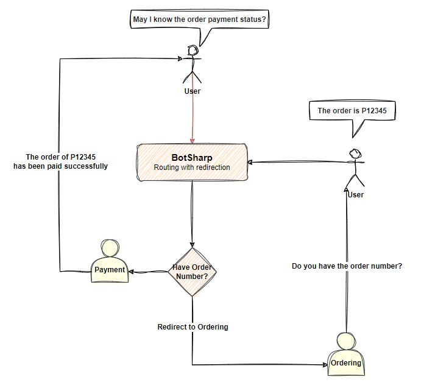
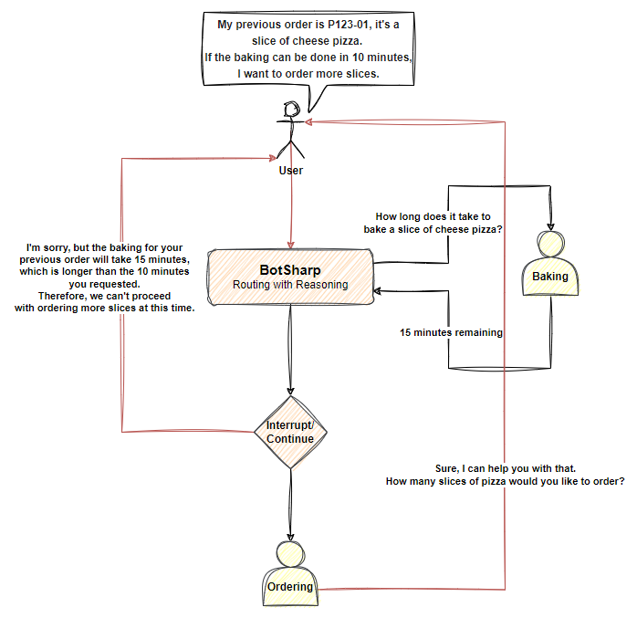

# Routing

Routing is an important function that allows multiple Agents to work together to complete enterprise-level tasks. When you apply LLM to your business system, it is inevitable to develop agents with different functions. How to effectively manage so many agents with different responsibilities is a challenging task. From an engineering perspective, each Different teams are responsible for the development of different Agents, and the teams will face the problem of mutual isolation between Agents. The ideal situation is that they can be developed independently but cooperate with each other.

## Router

The Routing feature is the core technology used by BotSharp to manage multiple Agents. BotSharp has a built-in intelligent Agent called `Router`. When you enable this function, all user requests will be pre-processed by the Router to determine which Agent to distribute the request to for processing. The advantage of Routing technology is that it can isolate different Agents and allow them to work together to achieve the user's goals. The adoption of `Routing` ensures that Agent can be scalable, flexible and robust enough in enterprise applications.

## Reasoner

For simple questions raised by users, the ordinary routing function can already handle it. However, for the scenario where the user has a long description and needs to disassemble the task, ordinary routing cannot handle it. At this time, the `Reasoning` feature needs to be turned on, and LLM will respond according to the problem. The complexity is broken down into different small tasks. These small tasks can be processed by the corresponding Agent. During the processing process, the Router will constantly adjust the next step plan to deal with the different results returned by the Agent.

For more **Routing** related information, please go to [Agent Routing](../agent/router.md).

## Profile

There is an array field called `Profile` in the Agent data model, which is used to store the current profiles. When this attribute is set in the `Router`, only matching Task Agents can be included in the routing candidate Agents list, which means that the Task Agent also To set the same profile name. Profiles allows you to enter multiple profiles, and the system will automatically combine them for processing.