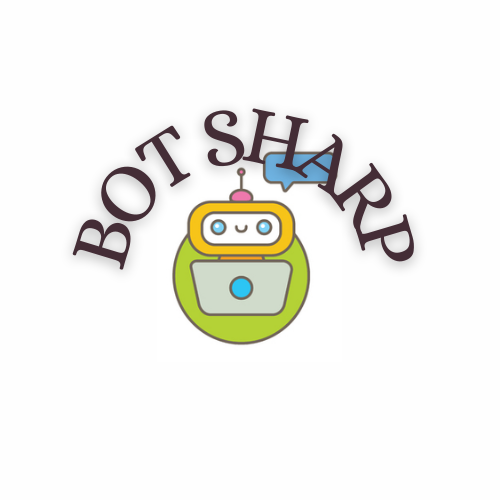

.. BotSharp documentation master file, created by
   sphinx-quickstart on Sun Aug 19 10:40:29 2018.
   You can adapt this file completely to your liking, but it should at least
   contain the root `toctree` directive.

The Open Source LLM Application Framework
======================================================

.. image:: https://img.shields.io/discord/1106946823282761851?label=Discord
    :target: `discord`_

**Connect LLMs to your application with .NET**

> The LLM powered Conversational Service building blocks and best practice 

*"Conversation as a platform (CaaP) is the future, so it's perfect that we're already offering the whole toolkits to .NET developers using BotSharp the Bot Platform Builder to build a CaaP. It opens up as much learning power as possible for your robots and precisely control every step of the AI processing pipeline."*

**BotSharp** is an open source AI framework for your enterprise-grade LLM applications. This project involves natural language understanding, computer vision and audio processing technologies, and aims to promote the development and application of intelligent robot assistants in business oriented systems. Out-of-the-box machine learning algorithms allow ordinary programmers to develop artificial intelligence applications faster and easier. 

It's witten in C# running on .NET which is a full cross-platform framework. C# is an enterprise-grade programming language which is widely used to code business logic in information management related system. More friendly to corporate developers. BotSharp adopts machine learning algrithm in C/C++ interfaces directly which skips the python interfaces. That will facilitate the feature of the typed language C#, and be easier when refactoring code in system scope. 

BotSharp is strictly in accordance with the components principle and decouples every part that is needed in the platform builder. So you can choose different UI/UX, or pick up a different Vector Storage, or select a more advanced algorithm to do NLU tasks. They are all modularized based on unified interfaces.

Indices and tables
==================
The main documentation for the site is organized into the following sections:

* :ref:`Get Started <get-started>`
* :ref:`Integration Documentation <integration-docs>`
* :ref:`Architecture Documentation <architecture-docs>`
* :ref:`search`

.. _get-started:

.. toctree::
   :maxdepth: 2
   :caption: Get Started with BotSharp
   
   quick-start/overview
   quick-start/get-started
   quick-start/installation

.. _agent-docs:

.. toctree::
   :maxdepth: 2
   :caption: Agent

   agent/intro
   agent/router
   agent/hook

.. toctree::
   :maxdepth: 2
   :caption: Conversation

   conversation/intro
   conversation/state
   conversation/hook

.. _integration-docs:

.. toctree::
   :maxdepth: 2
   :caption: Interactive Channels

   channels/intro
   channels/components
   channels/messenger
   channels/wechat

.. _knowledge-base:

.. toctree::
   :maxdepth: 2
   :caption: Knowledge Base

   knowledge-base/text-embedding
   knowledge-base/vector-database
   knowledge-base/similarity-search
   knowledge-base/build-qa-bot

.. _llm:

.. toctree::
   :maxdepth: 2
   :caption: Prompt Engineering

   llm/prompt
   llm/template
   llm/function
   llm/few-shot-learning
   llm/provider

.. _llamasharp:

.. toctree::
   :maxdepth: 2
   :caption: Use Local LLM Models

   llama-sharp/config-llamasharp
   llama-sharp/use-llamasharp-in-ui

.. _architecture-docs:

.. toctree::
   :maxdepth: 2
   :caption: Architecture
   
   architecture/authentication
   architecture/plugin
   architecture/hooks
   architecture/routing
   architecture/logging
   architecture/data-persistence

If you feel that this project is helpful to you, please Star us on the project, we will be very grateful.

.. _discord: https://discord.gg/qRVm82fKTS
