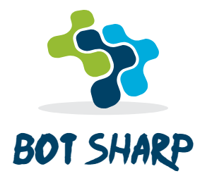

.. BotSharp documentation master file, created by
   sphinx-quickstart on Sun Aug 19 10:40:29 2018.
   You can adapt this file completely to your liking, but it should at least
   contain the root `toctree` directive.

The Open Source AI Bot Platform Builder
======================================================

.. image:: https://img.shields.io/badge/gitter-join%20chat-brightgreen.svg
    :target: `gitter`_

*"Conversation as a platform (CaaP) is the future, so it's perfect that we're already offering the whole toolkits to .NET developers using the BotSharp Bot Platform Builder to build a CaaP. It opens up as much learning power as possible for your robots and precisely control every step of the AI processing pipeline."*

**BotSharp** is an open source machine learning framework for AI Bot platform builder. This project involves natural language understanding, computer vision and audio processing technologies, and aims to promote the development and application of intelligent robot assistants in information systems. Out-of-the-box machine learning algorithms allow ordinary programmers to develop artificial intelligence applications faster and easier. 

It's witten  in C# running on .Net Core that is full cross-platform framework. C# is a enterprise grade programming language which is widely used to code business logic in information management related system. More friendly to corporate developers. BotSharp adopts machine learning algrithm in C/C++ interfaces directly which skips the python interfaces. That will facilitate the feature of the typed language C#, and be more easier when refactoring code in system scope. 

Why we do this? because we all know python is not friendly programming language for enterprise developers, it's not only because it's low performance but also it's a type weak language, it will be a disater if you use python to build your bussiness system.

BotSharp is in accordance with components princple strictly, decouples every part that needed in the platform builder. So you can choose different UI/UX, or pick up a different NLP Tagger, or select a more advanced algrithm to do NER task. They are all modulized based an unfied interfaces.

Some Features
-------------

* Integrated debugging is easier without relying on any other machine learning algorithm libraries.
* Built-in multi-Agents management, easy to build Bot as a Service platform.
* Context In/ Out with lifespan to make conversion flow be controllable.
* Use the natural language processing pipeline mechanism to work with extensions easily, and build your own unique robot processing flows. 
* Rewrote NLP algorithm from ground without historical issues.
* Support export/ import agent from other bot platforms directly. 
* Support different UI providers like `Rasa UI`_ and `Articulate UI`_.
* Support for multiple data request and response formats such as Rasa NLU and Dialogflow.
* Integrate with popular social platforms like Facebook Messenger, Slack and Telegram.
* Multi-core parallel computing optimization, High-Performance C# on GPUs in Hybridizer.

Indices and tables
==================
The main documentation for the site is organized into a couple sections:

* :ref:`User Documentation <user-docs>`
* :ref:`Integration Documentation <integration-docs>`
* :ref:`NLP Documentation <nlp-docs>`
* :ref:`Architecture Documentation <architecture-docs>`
* :ref:`search`

.. _user-docs:

.. toctree::
   :maxdepth: 3
   :caption: Hands-On Chatbot Platform:
   
   FrontCover
   overview
   installation
   agent/import-agent
   agent/train-agent
   agent/test-agent
   agent/optimize-agent

.. _integration-docs:

.. toctree::
   :maxdepth: 3
   :caption: Channels Integration Documentation:

   integrations/facebook-messenger
   integrations/slack
   integrations/telegram
   integrations/skype

.. _architecture-docs:

.. toctree::
   :maxdepth: 3
   :caption: Architecture Documentation:
   
   configuration/db
   configuration/platform

.. _nlp-docs:

.. toctree::
   :maxdepth: 3
   :caption: NLP Documentation:

   models/crf
   models/nb
   models/ngram
   models/svm
   models/tfidf
   models/penntreebank

If you feel that this project is helpful to you, please Star us on the project, we will be very grateful.

.. _Rasa UI: https://github.com/paschmann/rasa-ui
.. _Articulate UI: https://github.com/Oceania2018/articulate-ui
.. _gitter: https://gitter.im/botsharpcore/Lobby