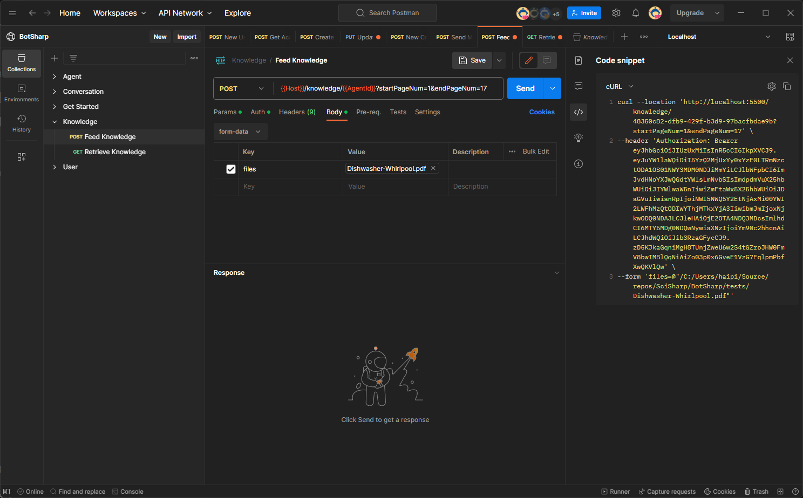
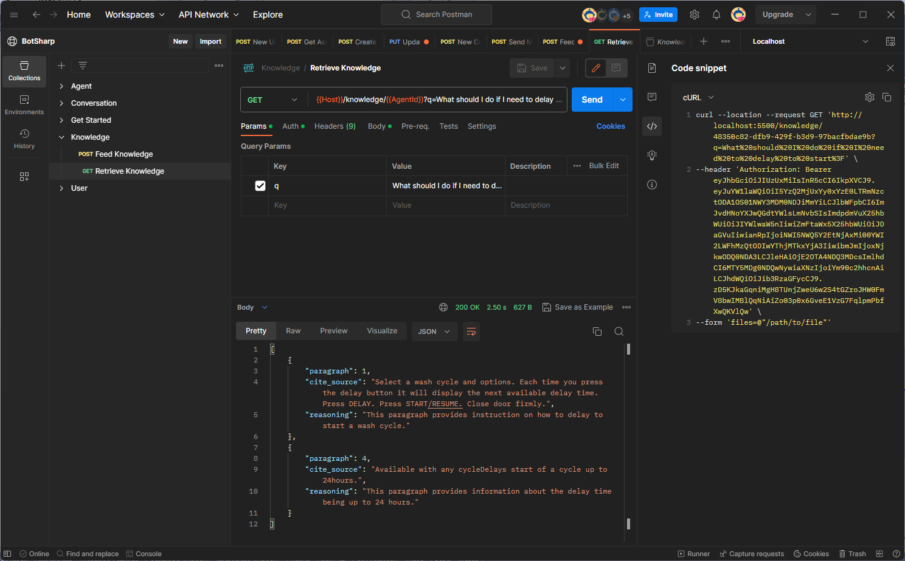

# Build Q&A Bot

## Feed knowledge

Use the feed knowledge interface to feed knowledge into the database. Before that, you need to create an Agent to manage the Chatbot, and the Agent's `id` is needed in subsequent operations.
`http://localhost:5500/knowledge/{agentId}`, You can add `startPageNum` and `endPageNum` to select useful parts of the document.

## Retrieve knowledge

After you have finished inputting knowledge, you can start asking related questions with your AI Assistant.

