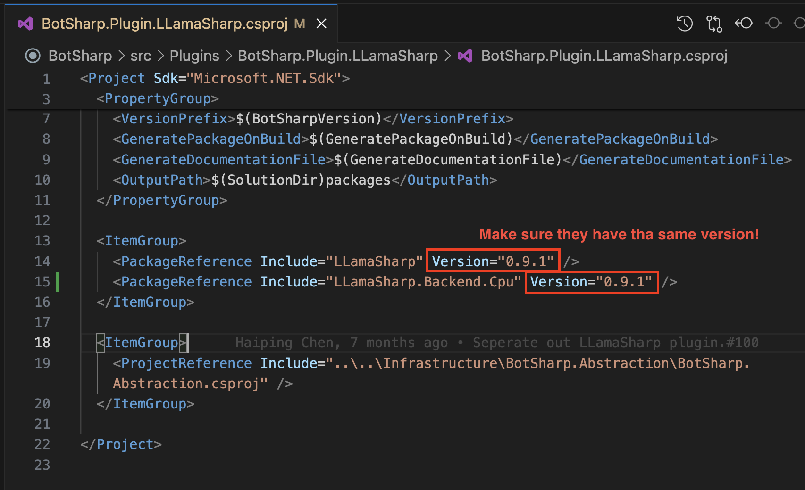

# Config LLamaSharp

BotSharp contains LLamaSharp plugin that allows you to run local llm models. To use the LLamaSharp, you need to config the BotSharp project with few steps.

## Install LLamaSharp Backend

Before use LLamaSharp plugin, you need to install one of the LLamaSharp backend services that suits your environment.

- [`LLamaSharp.Backend.Cpu`](https://www.nuget.org/packages/LLamaSharp.Backend.Cpu): Pure CPU for Windows & Linux. Metal for Mac.
- [`LLamaSharp.Backend.Cuda11`](https://www.nuget.org/packages/LLamaSharp.Backend.Cuda11): CUDA 11 for Windows and Linux
- [`LLamaSharp.Backend.Cuda12`](https://www.nuget.org/packages/LLamaSharp.Backend.Cuda12): CUDA 12 for Windows and Linux

**Please install the same version of LLamaSharp Backend with the LLamaSharp in BotSharp.Plugin.LLamaSharp.csproj.**



```shell
# move to the LLamaSharp Plugin Project
$ cd src/Plugins/BotSharp.Plugin.LLamaSharp
# Install the LLamaSharp Backend
$ dotnet add package LLamaSharp.Backend.Cpu --version 0.9.1
```

## Download and Config Local LLM Models

LLamaSharp supports many LLM Models like LLaMA and Alpaca. Download the `gguf` format models and save them in your machine.

We will use a [Llama 2](https://huggingface.co/TheBloke/llama-2-7B-Guanaco-QLoRA-GGUF) model in this tutorial.

After downloading the model, open the `src/WebStarter/appsettings.json` file to config the LLamaSharp models. Set the `LlmProviders` and `LlamaSharp` fields to correct settings as your computer. For example:

```json
{
    ...,
    "LlmProviders": [
        ...,
        {
            "Provider": "llama-sharp",
            "Models": [
                {
                "Name": "llama-2-7b.Q2_K.gguf",
                "Type": "chat"
                }
            ]
        },
        ...
    ],
    ...,
    "LlamaSharp": {
        "Interactive": true,
        "ModelDir": "/Users/wenwei/Desktop/LLM",
        "DefaultModel": "llama-2-7b.Q2_K.gguf",
        "MaxContextLength": 1024,
        "NumberOfGpuLayer": 20
    },
    ...
}
```

For more details about LLamaSharp, visit [LLamaSharp - GitHub](https://github.com/SciSharp/LLamaSharp).
