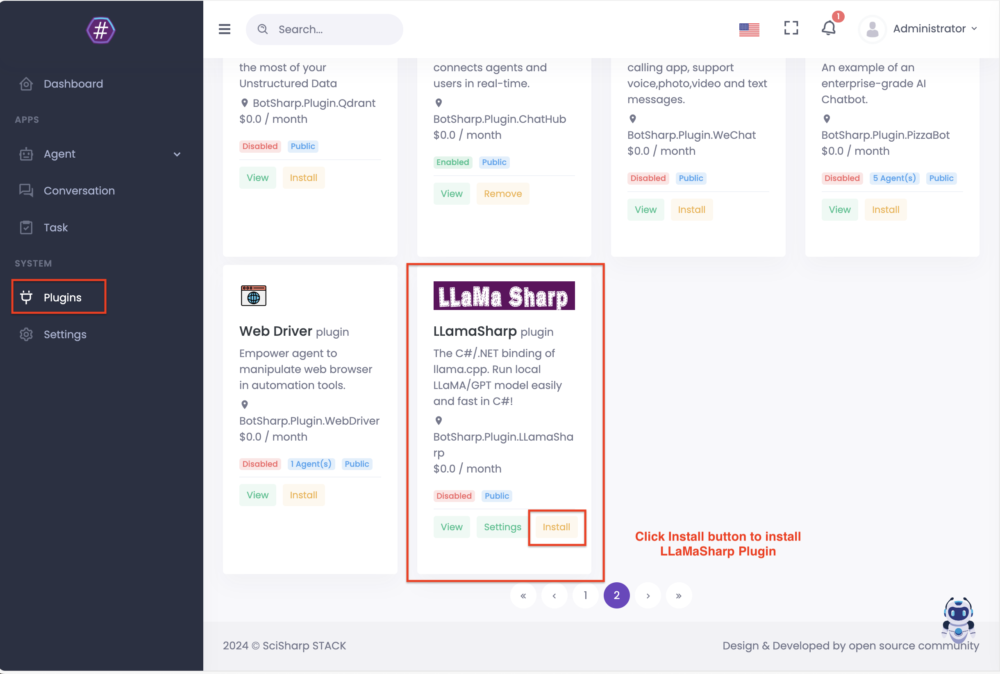
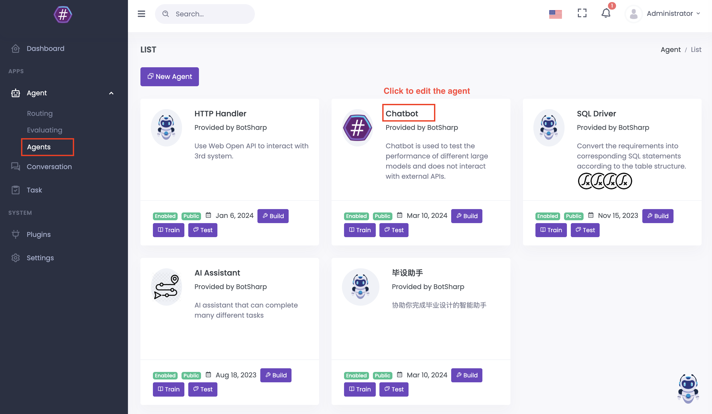
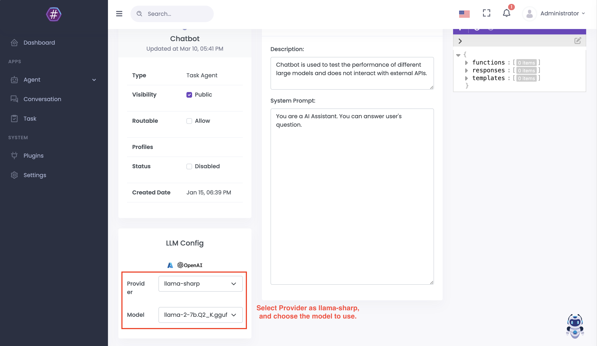
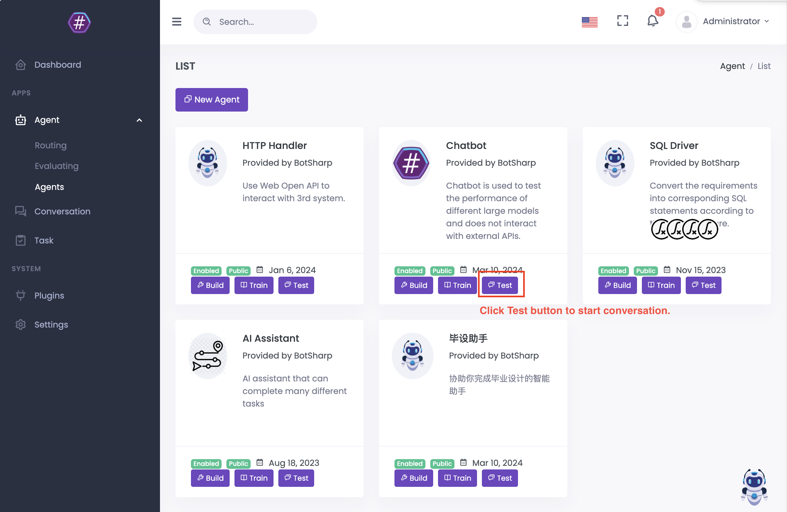
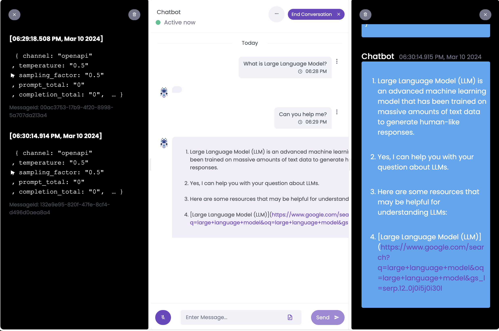
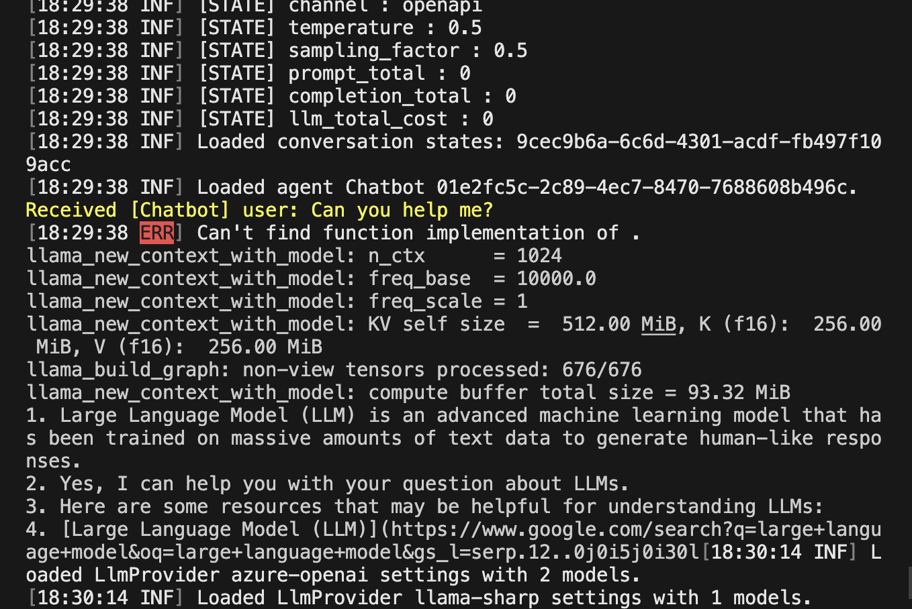

# Use LLamaSharp in BotSharp

Start the BotSharp backend and frontend services, and follow this tutorial.

## Install LLamaSharp Plugin in UI.

Go to the Plugin page and install LLamaSharp Plugin.

## Config LLamaSharp as LLM Providers for Agents

Edit or create an agent in Agents page, and config the agent.

In the edit page, config the provider as llama-sharp.

Then test the agent.

If run successfully, you will see log like this in BotSharp service's console.

