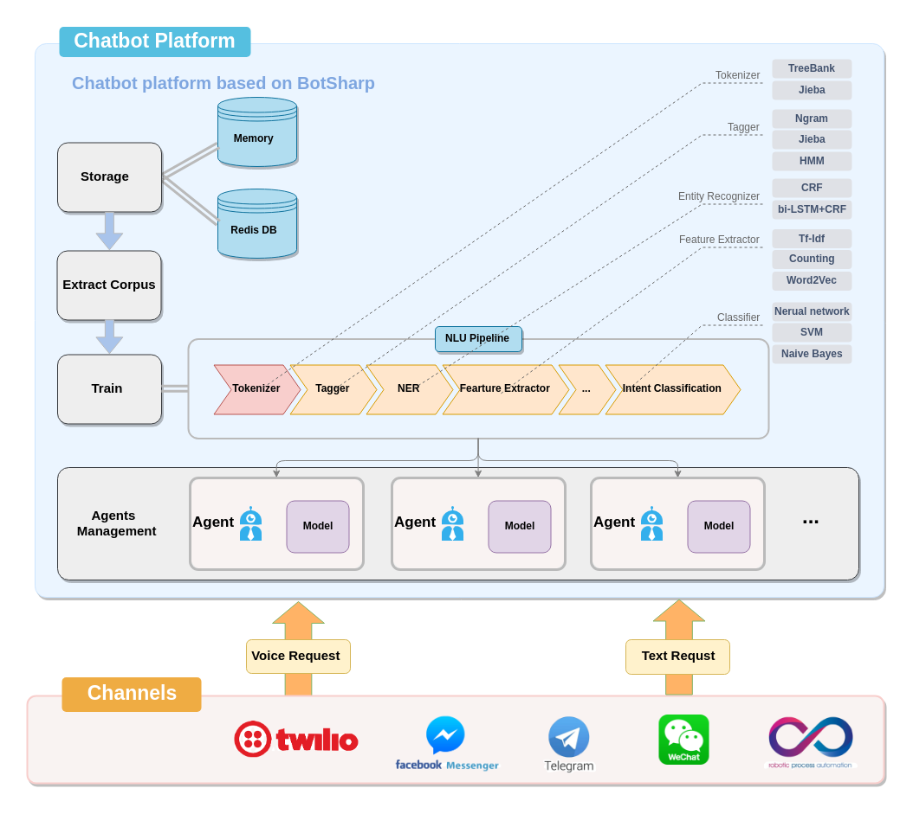
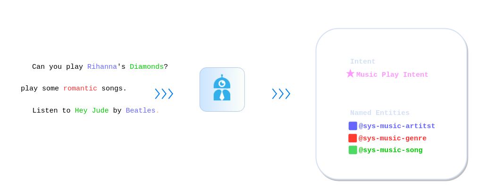
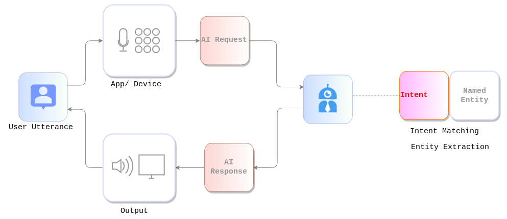
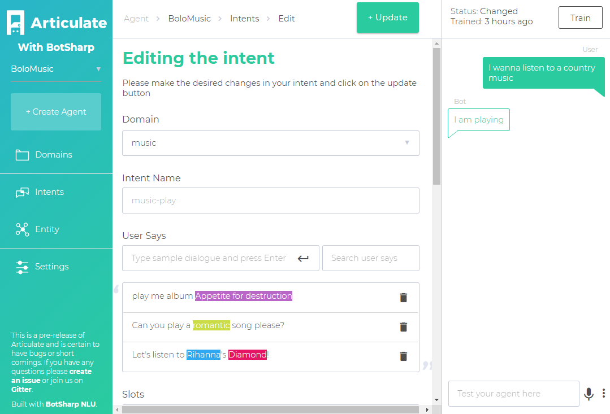

# BotSharp Overview
*Haiping Chen --06/18/2023*

BotSharp is an open source machine learning framework for AI Bot platform builder. This project involves natural language understanding and audio processing technologies, and aims to promote the development and application of intelligent robot assistants in information systems. Out of the box machine learning algorithms allow ordinary programmers to develop artificial intelligence applications faster and easier.

BotSharp is an high compatible and high scalable platform builder. It is in accordance with components princple strictly, decouples every part that needed in the platform builder. So you can choose different UI/UX, or pick up a different NLP Tagger, or select a more advanced algrithm to do NER task. They are all modulized based on unfied interfaces. 

From the chart ahead we can see that based on botsharp you can launch your own chatbot platform with 3 components:

- Storage module: Botsharp supports memory and redis DB 2 methods.
- Corpus extractor: To format data in template to feed into botsharp trainer. 
- NLU engine. Botsharp initiate a exclusive NLU engine and are open to users. 

BotSharp let you build conversational interfaces on top of your products and services by providing a natural language understanding (NLU) engine to process and understand natural language inut. 

Tradational computer interfaces require structured data, which makes the use of these interfaces unnatural and sometime difficult. While machine learning interfaces are data driven, which computer can find the logic or information behind the unstructured data(sentences).

For example. an simple request may like "Can you play country music?". Other users may ask "play some romantic songs." 

Even with this simple question, you can see conversational experience are hard to implemented. Interpreting and processing natural language requires a very robust language parser that has the capable of understanding the nuances of language.

Your code would have to handle all these different types of requests ro carry out the same logic: looking up some forecast information for a feature. For this reason, a traditional computer interface would tend to force users to input a well-known, standard request at the detriment of the user experience, because it's just easier.

However, BotSharp lets you easily achieve a conversational user experience by handling the natural language understanding (NLU) for you.When you use BotSharp, you can create agents that can understand the meaning of natural language and the nuances and trainslate that to structured meaning your software can understand.

## Agent
An agent helps you process user sentences (unstructure data) into structure data that you can use to return an appropriate response.
 
When users say something, your agent matches the user utterance to an exactly matched intent or closely matched intent.  Besides, the agent will return extra information about named entities which you need from the utterance. This can be name, location date or a host of other data categories (entities). You can define both the intent and the entities in your training data sets. You can also define what else to extact in your training phares as well.Then you can send a response to user to continue the conversation or to just end the conversation. It is very simple to create your own agent in BotSharp. The only thing you need is to assign you agent a name and a brief discription.
 

## Intent
To define how conversations work, you create intents in your agent that map user input to response. Generally an intent represents one dialog turn in a conversation. For example, you could create an music control angent recognise and responds to users. If a user said "Can you play Rihanna's Diamonds?". Your agent will do intent matching to music play intent, and responds to users a corresponding reply. It usually prompts users for another utterance which your agent will attempt to match another intent, and the conversation continues.

### Training Phrases
Training Phrases are collections of possible utterances that users might say to match a intent. You don't have to define every possible utterance of what user say. While we recommend users could define as more expression way as possible. It will help improve the robot understanding ability a lot. 

From the chart above we can see: An Intent consist of four main components:

- Intent name: The name of the intent
- Training phrases: Examples of what users can say to match a particular intent. BotSharp will automaticlly expand these phrases to match similar user utterances.
- Actions and parameters: Define how relevant information (Entities) are extracted from user utterances. You can use these parameters (entities) as input into other logic, such as looking up information, carry out a task, or returning a response.
- Response: An utterance that is spoken or displayed back to the user. 
## Named Entity
Named Entity is BotSharp mechanism for identfying and extacting useful data from user utterance text inputs. The difference between intent and entity is: intents allows your agent to understand the motivation behind a particular user input, on the other hand entities are used to extract out specific pieces of information that user mentions. Any important data you want to get from a user's request have a corresponding entity.

### Annotation Entities
Training Phrases allow your agent to successfully match user input to an intent. In order to help your agent with this matching process. You can annotate training phrases with entities. Entitty is a host of categories. For example, locations, organizations, persons and numbers are all entities. Annotation refers to the linking of words or values within training phrases to their corresponding entities. You can manually annotate you training phrases. Once a word or phrase is annotated, it will be highlight in your training phrases.

For example, imagine that you defined a training phrase like "Can you play Rihanna's Diamond please?" You can annotate Rihanna as an artist and Diamond as a song here. This annotation tells BotSharp to match more variations. like "Can you play Beattle's Hey Jude please?", or any other variation that have an artist and a song name combination. If you didn't annotate the phrase.For "Can you play Rihanna's Diamond" speaking, the agent would match user input that contained "Rihanna" and "Diamond" exactly, but not any other artists and any other songs. We recommend users could annotation properly in order to have a impressive intent classification experience.

## Channels
 When you already trained a chatbot on Botsharp, you may want it to play a really role in life. So we intergrate some popular channels in Botsharp including Twilio, facebook messenger, Telegram, WeChat and some other RPAs. These channels can make your robot "real" in life. For example, on facebook when a user visit your page and sends you a message, they can talk to your agent. You can also set a virtral assistant based on Twilio to chat with your clients for ordering, consulting, problem solving and many other business processes.