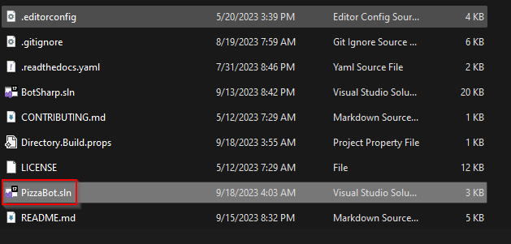
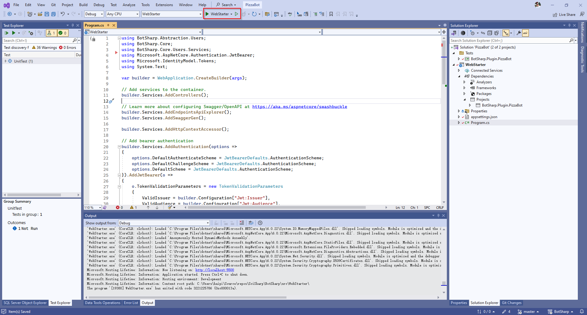
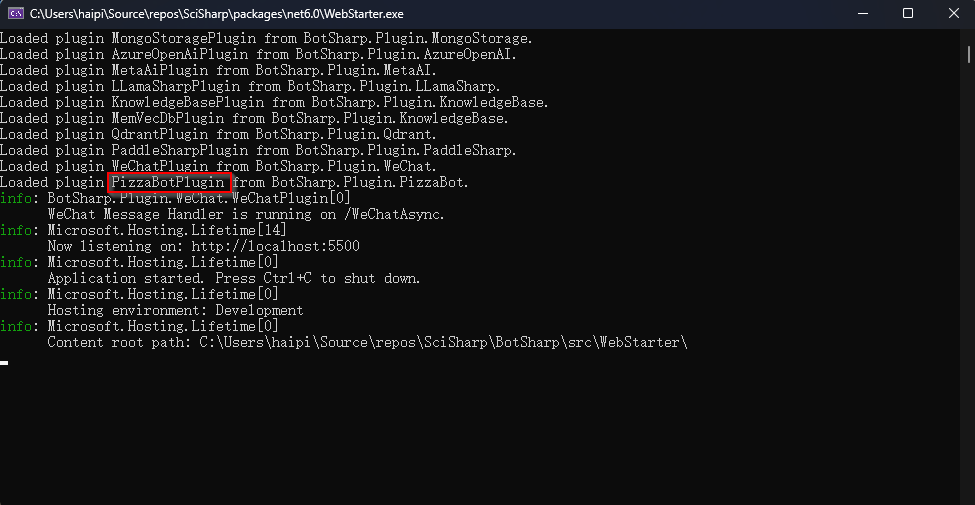
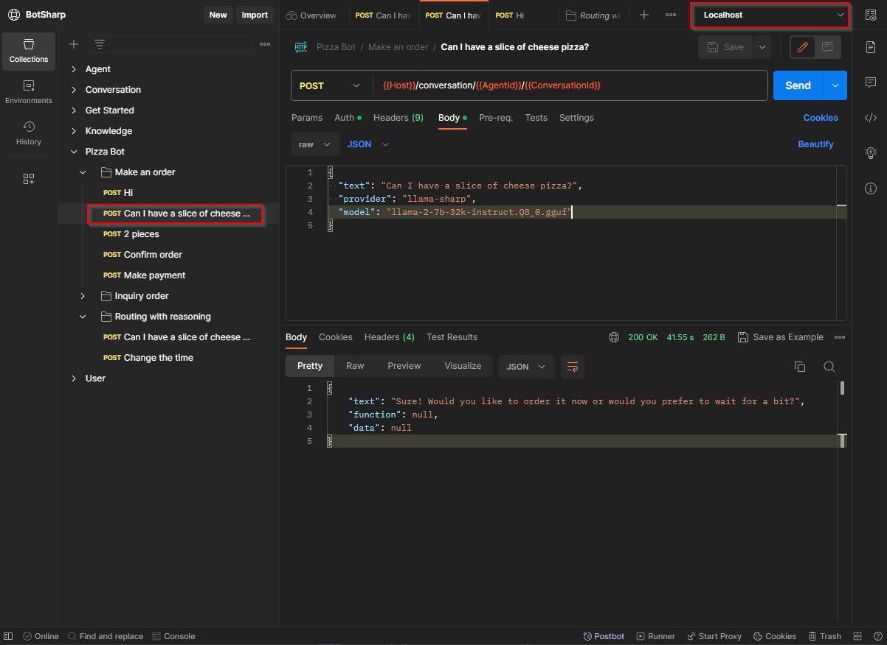

# Get Started

### Get started with Pizza Bot

In order to allow developers to experience the convenience of BotSharp as quickly as possible, we have designed a basic sample project PizzaBot. This example allows you to run it quickly on your local machine. This example requires `llama-2` quantized model downloaded with `gguf` format if you want to run locally.

```console
git clone https://github.com/SciSharp/BotSharp
```

Double click `PizzaBot` to start the solution.


Hit `WebStarter` to run it in Debug mode.


Here you go, you will see this running screen.


Next, try to access the chat from `Open API`, we public our [Postman collection](https://www.postman.com/orange-flare-634868/workspace/botsharp/collection/1346299-d1a31c49-825d-4449-bdc8-936c66ff6bfd). Remember to set the environment as `localhost`.

