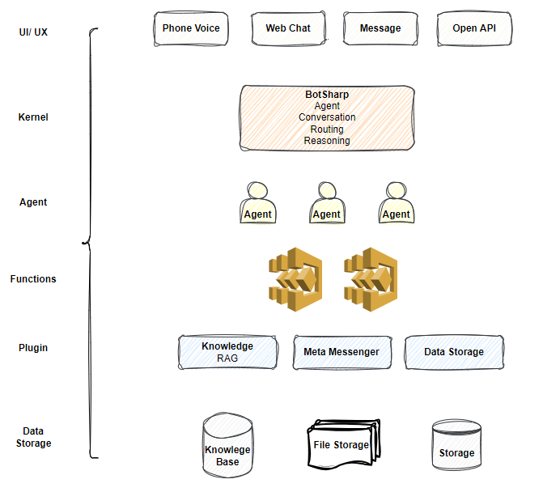

# Overview

BotSharp is an open source application framework to speed up integrate LLMs into your current business system. This project involves natural language understanding and audio processing technologies, and aims to promote the development and application of intelligent robot assistants in information systems. Out of the box machine learning algorithms allow ordinary programmers to develop artificial intelligence applications faster and easier.

BotSharp is an high compatible and high scalable platform builder. It is in accordance with components princple strictly, decouples every part that needed in the platform builder. So you can choose different UI/UX, or pick up a different NLP Tagger, or select a more advanced algrithm to do NER task. They are all modulized based on unfied interfaces. 

From the chart ahead we can see that based on botsharp you can launch your own chatbot platform with 3 components:

- Storage module: Botsharp supports memory and redis DB 2 methods.
- Corpus extractor: To format data in template to feed into botsharp trainer. 
- NLU engine. Botsharp initiate a exclusive NLU engine and are open to users. 

BotSharp let you build conversational interfaces on top of your products and services by providing a natural language understanding (NLU) engine to process and understand natural language inut. 

Tradational computer interfaces require structured data, which makes the use of these interfaces unnatural and sometime difficult. While machine learning interfaces are data driven, which computer can find the logic or information behind the unstructured data(sentences).

For example. an simple request may like "Can you play country music?". Other users may ask "play some romantic songs." 

Even with this simple question, you can see conversational experience are hard to implemented. Interpreting and processing natural language requires a very robust language parser that has the capable of understanding the nuances of language.

Your code would have to handle all these different types of requests ro carry out the same logic: looking up some forecast information for a feature. For this reason, a traditional computer interface would tend to force users to input a well-known, standard request at the detriment of the user experience, because it's just easier.

However, BotSharp lets you easily achieve a conversational user experience by handling the natural language understanding (NLU) for you. When you use BotSharp, you can create agents that can understand the meaning of natural language and the nuances and trainslate that to structured meaning your software can understand.