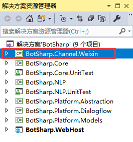
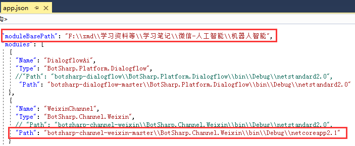
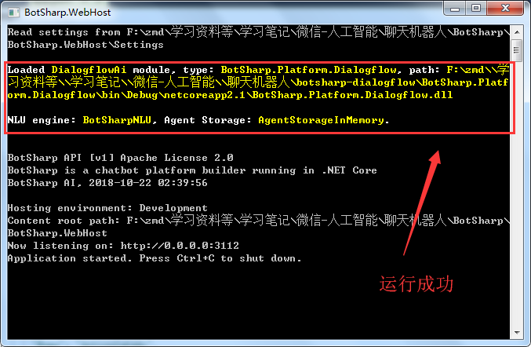
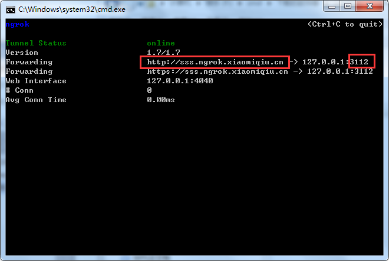
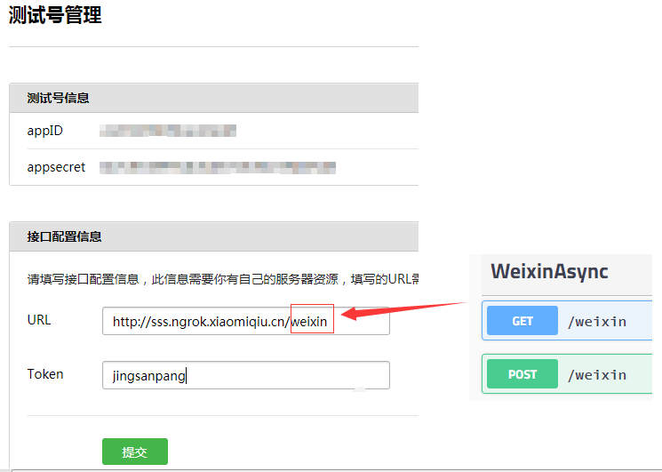
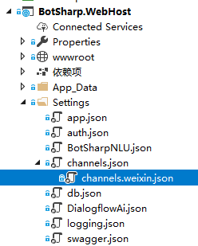
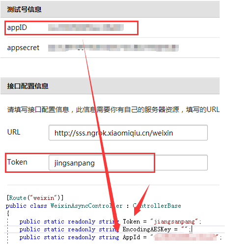

集成微信公众号主要是将BotSharp与微信公众号对接起来，搭建一个环境，为后续工作做好准备。

----------

# BotSharp的配置

  要与微信公众号对接，首先要成功运行BotSharp。下面详细讲解运行BotSharp的步骤：
## 加载项目
加载的项目为botsharp-channel-weixin和botsharp-dialogflow两个项目。
项目botsharp-channel-weixin为腾讯微信BotSharp的通道模块，加载此项目可以省去编写微信通道模块的过程，当然也可以根据自己的需求去编写微信的通道模块。

项目文件botsharp-channel-weixin下载地址(https://github.com/Oceania2018/botsharp-channel-weixin)  将botsharp-channel-weixin和botsharp-dialogflow项目放置到BotSharp同级的目录下。并加载到BotSharp中。

右键点击“==依赖项==”、“==添加引用==”，把botsharp-channel-weixin项目添加到BotSharp.WebHost的引用中。

				
找到BotSharp.WebHost下的app.json,修改moduleBasePath和botsharp-dialogflow的Path路径。程序会根据路径找到其项目的.dll。

	  
## 运行BotSharp
加载项目完毕，运行BotSharp项目，出现如下的黑色的控制台程序，表示程序找到了botsharp-dialogflow的.dll,项目运行成功。

运行成功后，打开网址为(http://localhost:3112/index.html)  的网页，此网页所显示的为BotSharp的接口列表。

# 对接微信公众号
## 申请微信测试号
在微信公众平台认证之前，我们可以先申请一个测试的公众号来进行测试，这对开发人员来说还是有很大好处的。(https://mp.weixin.qq.com/debug/cgi-bin/sandbox?t=sandbox/login)

## 测试号接口信息配置
**1)申请服务器**

我们所要填写的url必须是外网能够访问到的服务器地址，而且必须是80端口，通过服务器的地址你要能够让微信访问到你的项目。

我们需要把内网映射出去变成能够访问的外网，我们采取一个简单的方法，通过ngrok进行内网穿透。ngrok工具的下载地址：(http://ngrok.ciqiuwl.cn/)  下载完成后解压缩。

找到apps.bat文件，点击右键打开记事本进行编辑，,执行 *ngrok -config=ngrok.cfg -subdomain xxx 80*//(xxx 是你自定义的域名前缀)，如执行*ngrok -config=ngrok.cfg -subdomain sss 3112* ，双击弹出一个黑窗体，该黑窗体显示的域名就是映射出去的网址。

也有其它的方法得到外网网址，如通过路由器映射，可自行通过百度上网查询。

其中http://sss.ngrok.xiaomiqiu.cn  即为映射的外网IP

**2)填写接口配置信息**

url填写： http://外网IP/wx
Token：自主设置，这个token与公众平台wiki中常提的access_token不是一回事，这个token只用于验证开发者服务器。

Token是用于交互安全认证的，可任意填写，但要与服务端的校验微信的Controller一样。

打开BotSharp.Webhost下的channels.weixin.json

正确填写Token、AppId字符串。其中Token要与微信测试号中的Token相同。

填写完毕，打开ngrok并运行BotSharp项目，则可以成功提交微信测试号的接口配置信息。

填写JS接口安全域名，域名可随意填写。微信扫描关注测试公众号。
至此，集成微信公众号完成。

